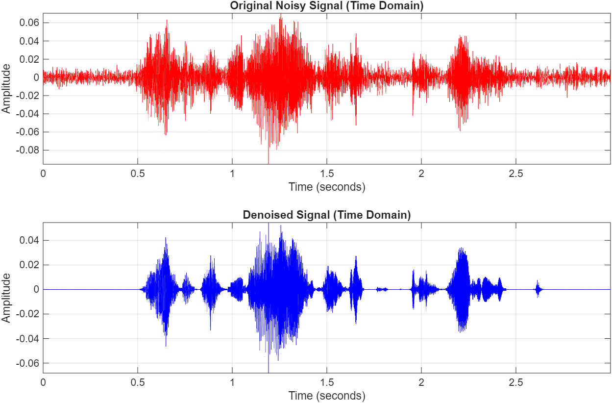
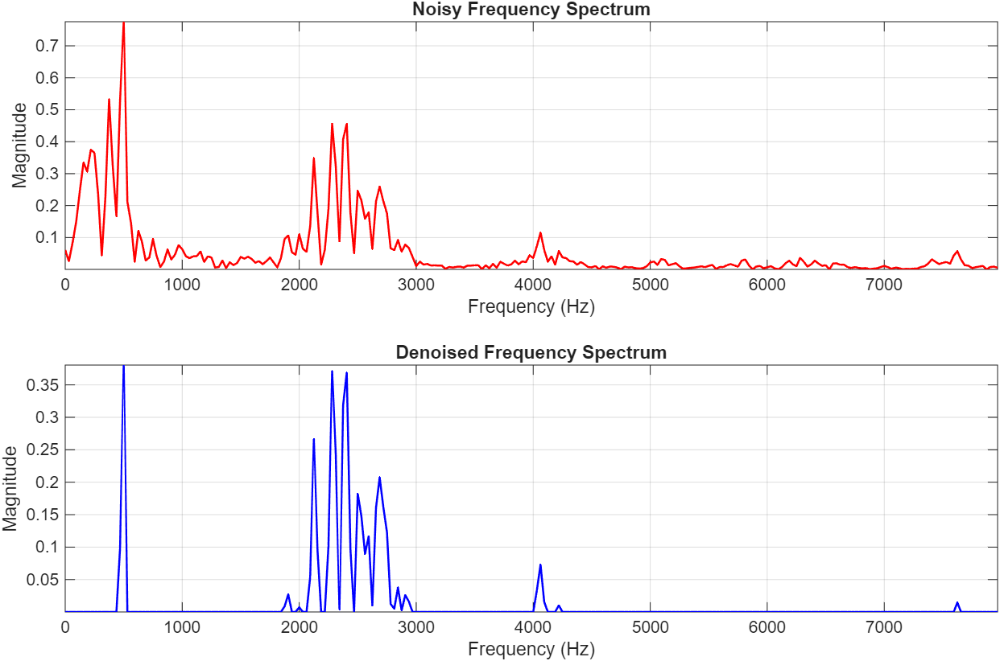

# audio denoising via custom fft & spectral subtraction (apr2026-sem252)


honestly just trying to survive this linear algebra project. made the fourier from-scratch without using `fft` or `ifft`. visualizations are for report.

---

## outline

### fourier.m
* **custom radix-2 fft:** achieve $O(N \log_2 N)$ efficiency, because the standard $N^2$ dft is very slow.
* **ifft:** uses the complex conjugate property to flip the spectrum back into the time domain.
* **manual hamming windowing:** tapers the frame boundaries to suppress the specxtral leakage.
* **overlap-add synthesis:** 50% overlapping hop size, so $H = L/2$.
* **magnitude thresholding:** used an over-subtraction factor $\alpha = 5.0$ and a spectral floor $\beta = 0.01$.

### hamming_window.m
* visualize hamming window concept for report part 4.1.1

### gainmask.m
* visualize gain computation and function properties behaviour for report part 4.1.2

---

## visual results

heres how it looks.

### time-domain
*top is the input audio. bottom is after the custom ifft put the pieces back together.*



### frequency-domain
*plotted up to the nyquist frequency. the hamming window stops the bleeding -> high magnitudes survive.*



### hamming window visualization
*graphed to help with understanding of the implementation of hamming window in the fourier.m file (for illustration purposes and not for real audio files).*
*based on code segments provided in 'Signals and Systems for Bioengineers A MATLAB-Based Introduction' by semmlow*


### gain function visualization
*graphed to help with understanding of properties in gain function introduced by tripathi and what its properties doing (for illustration purposes and not for real audio files).*
*based on code segments provided in 'Signals and Systems for Bioengineers A MATLAB-Based Introduction' by semmlow*


---

## usage

1.  **clone repo:**
    ```bash
    git clone [https://github.com/nrfdltr/fft-audio-denoising.git](https://github.com/nrfdltr/fft-audio-denoising.git)
    ```
2.  **run the script:** open matlab and run script
3.  have fun i go sleep now zzzzzZZz

---

## references
* **audio data:** from rajat borkar on kaggle. 
* **math:** tripathi et al. (2024)  for denoise pipeline (hamming, mag threshold, cola),

    harris (1978)  for hamming,

    mota (2022) for dft/fft, 

    wen (2025)   for ifft, 

    brunton (2022) for complex conjugate theory,

    semmlow(2012) for the hamming window and gain func visual matlab code.
* **implementation:** followed tripathi et al. '*quantum fourier transform–based denoising*' to implement denoise pipeline into matlab code fourier.m.
